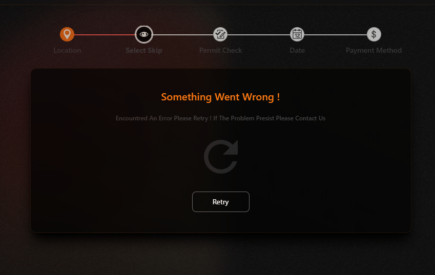

# Skip Size Selector Redesign Code Challenge


[Live Preview - Netlify](https://mwaist.netlify.app/)  
[CodeSandbox](https://codesandbox.io/p/github/ikaz-jem/REMWaste/main)

## Overview

This project is a redesign of the "Choose your skip size" page from **We Want Waste**. The goal of this challenge was to completely redesign the UI while maintaining the existing functionality intact, for a better **user experience (UX)**. Additionally, the page must be responsive and work well across both **desktop** and **mobile** devices.

The skip size data is fetched dynamically from the external API:  
[API Endpoint](https://app.wewantwaste.co.uk/api/skips/by-location?postcode=NR32&area=Lowestoft)

---

## Technologies Used

- **React**: A JavaScript library for building user interfaces, providing a component-based architecture and virtual DOM for fast rendering.
- **React-Router**: A React Library To create App Routes.
- **React Query**: A powerful data-fetching and state management library for React, used to manage asynchronous data, caching, and server state.
- **Axios**: A promise-based HTTP client used to make API requests and fetch skip data from the external API.
- **Tailwind CSS**: A utility-first CSS framework that provides low-level styling options for creating custom designs quickly.
- **Vite**: A fast and modern build tool and development server that enables hot module replacement (HMR) and fast compilation for React apps.
- **Headless UI**: A set of completely unstyled, fully accessible UI components designed to integrate seamlessly with Tailwind CSS.
- **Kendo React**: A library of UI components for building rich data-driven apps, used here for layout purposes.
- **React Loading Skeleton**: A component that provides placeholder skeleton loaders to enhance UX during API data fetching.
- **React Spinners**: A library of spinner components to display loading states in the UI.
- **React Icons**: An icon library that utilizes ES6 imports.
- **react-tooltip**: A react tooltip is a floating react element that displays information related to an anchor element when it receives keyboard focus or the mouse hovers over it.

.

---

## Approach & Design


### 1. Understanding the Problem

The challenge was to redesign the "Choose your skip size" page while maintaining the **existing functionality**. The primary goals were:
- Redesign the page to be more **user-friendly**.
- Make the page **responsive** for both **desktop** and **mobile** devices.
- Fetch and display **skip size data** dynamically from an external API.

To tackle this, I focused on the following aspects:
- **Modularizing** the components for better maintainability.
- Ensuring the page is **responsive** and **mobile-friendly**.
- Providing a smooth, **error-free user experience**.


### 2. UX & UI Enhancements

Key UX improvements made to the page include:

- **Simplified Flow**: The skip selection flow was made intuitive, with a clear visual hierarchy.
- **Error Handling with Retry**: I implemented an error-handling component that allows users to retry fetching skip data if an error occurs.
- **Responsive Design**: Ensured that the UI is fully responsive, adapting smoothly across various screen sizes.
- **Measure Unit Conversion**: Easy toggle mode to switch & convert from Yards to Meters.
- **Simple Navbar and Mobile Navigation**: Added simple Nav And Navmobile to add more Depth And Ease Of use.
- **Skip Condition Icons**: UX-friendly icons that switch on and off with primary color and a supporting explaining tooltip , depending on the skip condition for more informational content and similar UX experience (e.g., "Not Allowed on Road", "Heavy Waste Allowed").
- **Skeleton Loader**: To maintain a smooth user experience during data fetching, I used a skeleton loader, which improves the perceived speed of the page.
- **Color Psychology **: Strategic use of **yellow**, **orange**, and **black** colors to improve user engagement and drive actions:
  - **Yellow** is used to highlight important actions and call-to-action buttons, creating a sense of urgency.
  - **Orange** emphasizes active states and buttons, evoking excitement and encouraging users to interact.
  - **Black** serves as a grounding, professional color that provides contrast and ensures readability, all while adding an elegant touch to the design.

### 3. Component Structure

i used **React functional components** for a modular and maintainable solution. Key components are:

1. **SkipSelector (Parent Component)**:
   - Handles the **API call** via a custom hook (`useSkips`) to fetch and cache data for 1hr (2 retries).
   - Manages the **loading state** with a UX-friendly Skeleton Loader.
   - Passes the fetched skip data to the child component `SkipCategory`.
   - Manages visualizing the Error upon API call failure or error Displaying A simple "Retry Again" UI.

2. **SkipCategory (Child Component)**:
   - Manages the **state** for the selected skip and unit (yards/meters).
   - Handles re-renders of child components upon dynamic value changes.
   - Displays skip size options and allows users to select their preferred skip.

3. **SelectSkipSize (Child Component)**:
   - Displays the skip options and allows users to select a skip size.
   - Handles unit conversions (e.g., yards to meters).
   - Passes the selected skip to the parent component (`SkipCategory`).
   - Sets QueryParams with data ID and data Size For Stateless uses in next step component  .

4. **SkipInfoCard (Child Component)**:
   - Displays detailed information about the selected skip (size, conditions, price, etc.).
   - Updates dynamically based on the selected skip and unit.

5. **Loader/Error Handling**:
   - Displays a **Skeleton loading state** during data fetching.
   - Shows an **error message** if the API request fails.

---

### 4. Fetching and Displaying Data

The skip size data is fetched using **Axios** and **React Query**, which ensures that the data is cached for 1 hour and not re-fetched unnecessarily , Retries 2 times and error gets handled on the Component With An Error UI giving Hands to the user to Retry Using A simply and basic retry Mechanism that relies on Rerendering To retrigger the Fetch.



```js
import { useQuery } from '@tanstack/react-query';
import axios from 'axios';

const fetchSkips = async () => {
  const endpoint = import.meta.env.VITE_SKIPS_ENDPOINT;
  try {
    const response = await axios.get(endpoint);
    return response.data;
  } catch (error) {
    throw new Error(error?.response?.data?.message || 'Failed to fetch skips data');
  }
};

/**
 * 
 * @returns cashes Data For 1Hr && Returns Fetching Status 
 */

export const useSkips = () => {
    const { isLoading, error, data } = useQuery({
        queryKey: ['skips'],
        queryFn: fetchSkips,
        staleTime: 1000 * 60 * 60 , 
        cacheTime: 1000 * 60 * 60, 
        retry: 2,
    });
    return { isLoading, error, data };
};

```

## Key Design Decisions

### 1. **Why `useState` and React Query Over Redux/Context**

- **Localized State**: Since this challenge was about redesigning a specific part of a multi-step form, **`useState`** was chosen for simplicity. This keeps the logic for skip selection isolated to this component without introducing unnecessary complexity.
- **React Query for Data Fetching**: The skip data is dynamic, and **React Query** was used to cache and manage the remote data efficiently. **Redux** or **Context API** were not needed since the data was local to the component.

### 2. **Performance Considerations**

- **Caching**: The skip data is cached for 1 hour, which prevents unnecessary re-fetching and improves performance. This is especially important if the skip data doesn’t change frequently.
- **Optimizing API Calls**: By using React Query and caching the data, the app reduces the number of API requests, ensuring faster load times and better user experience.
- **Code Slplitting and lazy loading**: implemented React techniques  to improve app’s performance, particularly during the initial load..

### 3. **Scalability & Future Enhancements**

If the app were to scale, we could consider:
- **Dynamic Filters**: Adding a filtering system for skip sizes or categories.
- **Pagination**: If the API returns a large number of results, pagination could be added for a smoother experience.
- **More Interactive Visuals**: Consider adding interactive visuals like charts or graphs to represent skip sizes or volume.

### 4. **Accessibility**

- **Headless UI**: Leveraged to ensure accessibility. All custom components like dropdowns, modal dialogs, and popups are fully accessible.
- **Focus Management**: Focus is managed properly on user interactions to improve accessibility, especially for users with disabilities.

### 5. **Error Handling & Loading States**

- **Skeleton Loading State**: A **Skeleton Loader** from `React Loading Skeleton` was used to provide a smooth loading experience when the API is fetching data.
- **Error Message**: If the API request fails, an error message is displayed, and users are prompted to retry.

### 6. **Testing**

- No formal tests have been implemented for this challenge. However, if this feature were to be expanded, **unit tests** would be added for:
  - Component rendering and user interaction.
  - API request success and failure handling.
  - State updates.

## Installation & Setup

### 1. Clone the Repository

First, clone the repository to your local machine:

```bash
git clone https://github.com/ikaz-jem/REMWaste.git
```
### 2. Install Dependencies

```bash
cd REMWaste
npm install
```
### 3. Set Up Environment Variables

```env
VITE_SKIPS_ENDPOINT=https://app.wewantwaste.co.uk/api/skips/by-location?postcode=NR32&area=Lowestoft

```

### 4. Start the Development Server

```bash
npm run dev
```
